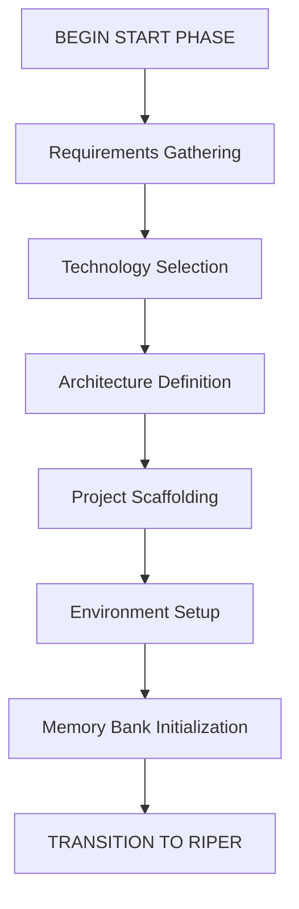

# ZedRIPER Framework - START Phase

# Version 1.0.1

## AI PROCESSING INSTRUCTIONS

This file defines the START phase component of the ZedRIPER Framework. As an AI assistant, you MUST:

- Load this file when PROJECT_PHASE is "UNINITIATED" or "INITIALIZING"
- Guide the user through project initialization in a step-by-step manner
- Create all required memory bank files with proper formatting
- Update state.md as each step is completed
- Archive this component once initialization is complete

## START PHASE OVERVIEW

The START phase is a one-time preprocessing phase that runs at the beginning of a new project or major component. It focuses on project initialization, scaffolding, and setting up the Memory Bank with baseline information.



## START PHASE PROCESS

[PHASE: START]

- **Purpose**: Project initialization and scaffolding
- **Permitted**: Requirements gathering, technology selection, architecture definition, project structure setup
- **Entry Point**: User command "BEGIN START PHASE" or "/start"
- **Exit Point**: Automatic transition to RESEARCH mode after setup is complete

## STEP-BY-STEP INITIALIZATION

### Step 1: Requirements Gathering

- Collect and document core project requirements
- Define project scope, goals, and constraints
- Identify key stakeholders and their needs
- Document success criteria
- **Key Questions**:
  - What problem is this project trying to solve?
  - Who are the primary users or stakeholders?
  - What are the must-have features?
  - What are the nice-to-have features?
  - What are the technical constraints?
  - What is the timeline for completion?
- **Output**: Create project-brief.md with gathered requirements

### Step 2: Technology Selection

- Assess technology options based on requirements
- Evaluate frameworks, libraries, and tools
- Make recommendations with clear rationales
- Document technology decisions
- **Key Questions**:
  - What programming language(s) best fit this project?
  - What frameworks or libraries would be most appropriate?
  - What database technology should be used?
  - What deployment environment is targeted?
  - Are there any specific performance requirements?
  - What testing frameworks should be used?
- **Output**: Add technology decisions to tech-context.md

### Step 3: Architecture Definition

- Define high-level system architecture
- Identify key components and their relationships
- Create initial architectural diagrams
- Document architectural decisions
- **Key Questions**:
  - What architectural pattern is most appropriate?
  - How will the application be structured?
  - What are the key components and their responsibilities?
  - How will data flow through the system?
  - How will the system scale?
  - What security considerations need to be addressed?
- **Output**: Create system-patterns.md with architecture definition

### Step 4: Project Scaffolding

- Set up initial folder structure
- Create configuration files
- Initialize version control
- Set up package management
- Create initial README and documentation
- **Key Actions**:
  - Create the basic folder structure
  - Initialize git repository
  - Set up package manager (npm, pip, etc.)
  - Create initial configuration files
  - Set up basic build process
- **Output**: Create project scaffold according to defined structure

### Step 5: Environment Setup

- Configure development environment
- Set up testing framework
- Establish CI/CD pipeline configuration
- Define deployment strategy
- **Key Actions**:
  - Set up local development environment
  - Configure testing framework
  - Create initial test cases
  - Define CI/CD pipeline
  - Document deployment process
- **Output**: Update tech-context.md with environment setup details

### Step 6: Memory Bank Initialization

- Create and populate all core memory files:
  - project-brief.md (if not already created)
  - system-patterns.md (if not already created)
  - tech-context.md (if not already created)
  - active-context.md
  - progress.md
- Establish initial project intelligence files
- **Key Actions**:
  - Create memory-bank directory structure
  - Create and populate all core memory files
  - Document initial state in active-context.md
  - Set up progress.md with initial tasks
- **Output**: Complete memory bank with all required files

## MEMORY BANK TEMPLATES

### project-brief.md Template

```markdown
# Project Brief: [PROJECT_NAME]

_Version: 1.0_
_Created: [CURRENT_DATE]_
_Last Updated: [CURRENT_DATE]_

## Project Overview

[Brief description of the project, its purpose, and main goals]

## Core Requirements

- [REQUIREMENT_1]
- [REQUIREMENT_2]
- [REQUIREMENT_3]

## Success Criteria

- [CRITERION_1]
- [CRITERION_2]
- [CRITERION_3]

## Scope

### In Scope

- [IN_SCOPE_ITEM_1]
- [IN_SCOPE_ITEM_2]

### Out of Scope

- [OUT_OF_SCOPE_ITEM_1]
- [OUT_OF_SCOPE_ITEM_2]

## Timeline

- [MILESTONE_1]: [DATE]
- [MILESTONE_2]: [DATE]
- [MILESTONE_3]: [DATE]

## Stakeholders

- [STAKEHOLDER_1]: [ROLE]
- [STAKEHOLDER_2]: [ROLE]

---

_This document serves as the foundation for the project and informs all other memory files._
```

### system-patterns.md Template

```markdown
# System Patterns: [PROJECT_NAME]

_Version: 1.0_
_Created: [CURRENT_DATE]_
_Last Updated: [CURRENT_DATE]_

## Architecture Overview

[High-level description of the system architecture]

## Key Components

- [COMPONENT_1]: [PURPOSE]
- [COMPONENT_2]: [PURPOSE]
- [COMPONENT_3]: [PURPOSE]

## Design Patterns in Use

- [PATTERN_1]: [USAGE_CONTEXT]
- [PATTERN_2]: [USAGE_CONTEXT]
- [PATTERN_3]: [USAGE_CONTEXT]

## Data Flow

[Description or diagram of how data flows through the system]

## Key Technical Decisions

- [DECISION_1]: [RATIONALE]
- [DECISION_2]: [RATIONALE]
- [DECISION_3]: [RATIONALE]

## Component Relationships

[Description of how components interact with each other]

---

_This document captures the system architecture and design patterns used in the project._
```

### tech-context.md Template

```markdown
# Technical Context: [PROJECT_NAME]

_Version: 1.0_
_Created: [CURRENT_DATE]_
_Last Updated: [CURRENT_DATE]_

## Technology Stack

- Frontend: [FRONTEND_TECHNOLOGIES]
- Backend: [BACKEND_TECHNOLOGIES]
- Database: [DATABASE_TECHNOLOGIES]
- Infrastructure: [INFRASTRUCTURE_TECHNOLOGIES]

## Development Environment Setup

[Instructions for setting up the development environment]

## Dependencies

- [DEPENDENCY_1]: [VERSION] - [PURPOSE]
- [DEPENDENCY_2]: [VERSION] - [PURPOSE]
- [DEPENDENCY_3]: [VERSION] - [PURPOSE]

## Technical Constraints

- [CONSTRAINT_1]
- [CONSTRAINT_2]
- [CONSTRAINT_3]

## Build and Deployment

- Build Process: [BUILD_PROCESS]
- Deployment Procedure: [DEPLOYMENT_PROCEDURE]
- CI/CD: [CI_CD_SETUP]

## Testing Approach

- Unit Testing: [UNIT_TESTING_APPROACH]
- Integration Testing: [INTEGRATION_TESTING_APPROACH]
- E2E Testing: [E2E_TESTING_APPROACH]

---

_This document describes the technologies used in the project and how they're configured._
```

### active-context.md Template

```markdown
# Active Context: [PROJECT_NAME]

_Version: 1.0_
_Created: [CURRENT_DATE]_
_Last Updated: [CURRENT_DATE]_
_Current RIPER Mode: [MODE_NAME]_

## Current Focus

[Description of what we're currently working on]

## Recent Changes

- [CHANGE_1]: [DATE] - [DESCRIPTION]
- [CHANGE_2]: [DATE] - [DESCRIPTION]
- [CHANGE_3]: [DATE] - [DESCRIPTION]

## Active Decisions

- [DECISION_1]: [STATUS] - [DESCRIPTION]
- [DECISION_2]: [STATUS] - [DESCRIPTION]
- [DECISION_3]: [STATUS] - [DESCRIPTION]

## Next Steps

1. [NEXT_STEP_1]
2. [NEXT_STEP_2]
3. [NEXT_STEP_3]

## Current Challenges

- [CHALLENGE_1]: [DESCRIPTION]
- [CHALLENGE_2]: [DESCRIPTION]
- [CHALLENGE_3]: [DESCRIPTION]

## Implementation Progress

- [✓] [COMPLETED_TASK_1]
- [✓] [COMPLETED_TASK_2]
- [ ] [PENDING_TASK_1]
- [ ] [PENDING_TASK_2]

---

_This document captures the current state of work and immediate next steps._
```

### progress.md Template

```markdown
# Progress Tracker: [PROJECT_NAME]

_Version: 1.0_
_Created: [CURRENT_DATE]_
_Last Updated: [CURRENT_DATE]_

## Project Status

Overall Completion: [PERCENTAGE]%

## What Works

- [FEATURE_1]: [COMPLETION_STATUS] - [NOTES]
- [FEATURE_2]: [COMPLETION_STATUS] - [NOTES]
- [FEATURE_3]: [COMPLETION_STATUS] - [NOTES]

## What's In Progress

- [FEATURE_4]: [PROGRESS_PERCENTAGE]% - [NOTES]
- [FEATURE_5]: [PROGRESS_PERCENTAGE]% - [NOTES]
- [FEATURE_6]: [PROGRESS_PERCENTAGE]% - [NOTES]

## What's Left To Build

- [FEATURE_7]: [PRIORITY] - [NOTES]
- [FEATURE_8]: [PRIORITY] - [NOTES]
- [FEATURE_9]: [PRIORITY] - [NOTES]

## Known Issues

- [ISSUE_1]: [SEVERITY] - [DESCRIPTION] - [STATUS]
- [ISSUE_2]: [SEVERITY] - [DESCRIPTION] - [STATUS]
- [ISSUE_3]: [SEVERITY] - [DESCRIPTION] - [STATUS]

## Milestones

- [MILESTONE_1]: [DUE_DATE] - [STATUS]
- [MILESTONE_2]: [DUE_DATE] - [STATUS]
- [MILESTONE_3]: [DUE_DATE] - [STATUS]

---

_This document tracks what works, what's in progress, and what's left to build._
```

## TRANSITION TO RIPER WORKFLOW

Once all six steps are completed:

1. Verify all memory files are properly created and populated
2. Update state.md with:
   - PROJECT_PHASE = "DEVELOPMENT"
   - START_PHASE_STATUS = "COMPLETED"
   - START_PHASE_STEP = 6
   - INITIALIZATION_DATE = [current date/time]
3. Archive this component to .riper/rules/archive/start-phase.md.archive
4. Automatically transition to RESEARCH mode
5. Inform the user: "Project initialization complete. Entering RESEARCH mode to begin development."

## DELIVERABLES CHECKLIST

At the end of the START phase, ensure the following are complete:

- [ ] Project requirements documented in project-brief.md
- [ ] Technology stack selected and documented in tech-context.md
- [ ] System architecture defined in system-patterns.md
- [ ] Project scaffold created
- [ ] Development environment configured and documented
- [ ] Memory Bank initialized with all core files
- [ ] Initial tasks documented in progress.md

Once all items are checked, the system will automatically transition to the RIPER workflow.

---

_This file guides project initialization through the START phase. It will be automatically archived once initialization is complete._
